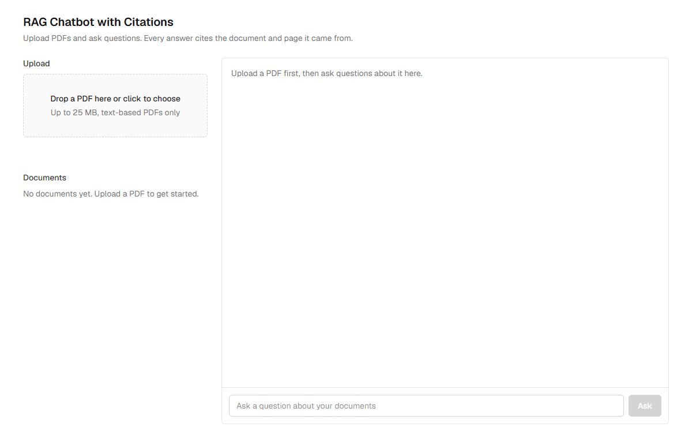
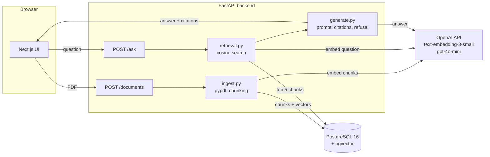

# RAG Chatbot with Citations

A chatbot that answers questions from your PDFs, cites the document and page for every answer, and says "I don't have that in the documents" instead of guessing.



## Problem

Teams keep their rules in PDFs: handbooks, policies, contracts, manuals. Finding an answer means opening the right file and scrolling to the right page. A general chatbot is faster but has two failure modes that make it unusable for real decisions: it invents answers when it does not know, and it gives no way to check where an answer came from.

## Solution

This project is a retrieval-augmented generation (RAG) service with two hard guarantees.

- **Every answer is traceable.** The response includes the document name, the page number and the sentence from that page that supports the answer. A reader can open the PDF and verify in seconds.
- **The bot does not guess.** If the retrieved pages do not contain the answer, the reply is exactly `I don't have that in the documents`. This is enforced in code as well as in the prompt, and it is measured on an evaluation set that includes questions designed to tempt the model into guessing.

The rest is a clean, small codebase: a FastAPI backend, a Next.js interface, one PostgreSQL database that holds both the text and the vectors, and the OpenAI SDK used directly with no framework in between.

## Architecture



Upload: the PDF is read page by page, each page is split into overlapping chunks that never cross a page boundary, each chunk is embedded and stored with its document and page number.

Ask: the question is embedded, the five most similar chunks are retrieved by cosine similarity, and the model answers from those numbered sources only. The backend parses the source numbers out of the answer and returns just the cited chunks as citations.

## Stack

| Layer | Choice |
|---|---|
| Backend | Python 3.13, FastAPI, OpenAI SDK used directly (no LangChain) |
| Models | `text-embedding-3-small` for embeddings, `gpt-4o-mini` for answers |
| Database | PostgreSQL 16 with pgvector (HNSW index), in Docker |
| Frontend | Next.js App Router, TypeScript, Tailwind |
| PDF parsing | pypdf |
| Tests | pytest with OpenAI and the database replaced by fakes |
| Packaging | Docker Compose for the whole stack |

## Evaluation results

The evaluation set has 30 questions about the sample document, the US Department of the Interior "Absence and Leave Handbook" (2012, public domain). It was deliberately hardened: 20 direct questions, 3 paraphrased in everyday wording that does not match the handbook's terms, 3 that need facts from two different pages, and 9 unanswerable questions, 4 of which are close to the handbook's topic (other agencies' leave rules, paid parental leave, compensatory time) to tempt the model into guessing.

`gpt-4o-mini` judges each answer and says yes only if every fact in the expected answer is present. A citation counts only if every expected page is cited.

Latest run (2026-09-28), against the full Docker Compose stack:

| Metric | Result |
|---|---|
| Answer accuracy (all 30) | 97% |
| Answer accuracy (answerable) | 95% |
| Citation accuracy (answerable) | 90% |
| Refusal accuracy (unanswerable) | 100% |
| False refusals (answerable) | 0 of 21 |

By question group:

| Group | Description | Correct |
|---|---|---|
| base | Base set, direct questions | 20 of 20 |
| paraphrase | Paraphrased wording | 3 of 3 |
| two-page | Needs two pages | 2 of 3 |
| near-topic | Unanswerable, close to the handbook topic | 4 of 4 |

Two-page questions are the weak spot: the second page is sometimes not among the five retrieved chunks, so the model cannot cite it. That is a retrieval limitation of single-vector search on compound questions, and a candidate for query decomposition or a larger retrieval window. The per-question table is in [eval/results.md](eval/results.md). The questions were written by the author, so treat this as a regression check rather than an independent benchmark.

## How citations and refusal work

Citations:

1. Chunks are created within a page, never across pages, so every stored chunk knows its document and page number.
2. The prompt lists the retrieved chunks as numbered sources, `[1] (handbook.pdf, p.12) <text>`, and instructs the model to append the bracket number after each claim.
3. The backend parses the `[n]` markers out of the answer and returns only the cited chunks. Retrieved but uncited chunks are dropped.
4. The snippet under each citation is the sentence of the chunk with the most keyword overlap with the question and the answer, so the reader sees the supporting line rather than the top of the page.

Refusal, in two layers:

- **Code layer.** If the best similarity is below a threshold, the model is not called and the refusal is returned at zero cost. On this document the threshold cannot separate near-topic questions from real ones (some unanswerable questions score higher than answerable ones), so it is set low, at 0.35, and acts only as a filter for clearly off-topic input.
- **Prompt layer.** The model is told to reply with the exact refusal sentence when the sources do not contain the answer. If the answer contains that sentence, or cites no sources at all, the response is normalised to the refusal with no citations and `refused: true`. This layer scored 9 of 9 on the unanswerable questions, including the near-topic ones.

## Setup

Requirements: Docker Desktop and an OpenAI API key.

```bash
git clone https://github.com/Khalid-Mehmood-117/rag-chatbot-with-citations.git
cd rag-chatbot-with-citations
cp .env.example .env
docker compose up --build
```

Set `OPENAI_API_KEY` in `.env` after copying it. Then open http://localhost:3000. The API and its interactive docs are at http://localhost:8000/docs. If port 3000 is taken on your machine, set `FRONTEND_PORT` and the matching `CORS_ORIGINS` in `.env` as shown in `.env.example`.

For local development without Docker for the app itself, see the commands in [PLAN.md](PLAN.md) and the [frontend README](frontend/README.md). Backend tests run offline:

```bash
cd backend && pytest
```

## Design decisions

- **OpenAI SDK directly, no LangChain.** The whole pipeline is a handful of short functions in `backend/app`. Anyone reviewing the code can read every step, and there is no framework version to chase.
- **One database for text and vectors.** pgvector keeps documents, chunks and embeddings in PostgreSQL. No separate vector service to deploy, back up or pay for.
- **Chunks never cross pages.** This costs a little retrieval quality at page boundaries and buys exact page citations, which is the point of the project.
- **Word-based chunking.** 600 words with a 75 word overlap is roughly 800 and 100 tokens. It avoids a tokenizer dependency and is easy to reason about.
- **Refusal in code and in the prompt.** Neither layer is reliable alone. Together they produced 9 of 9 refusals and 0 false refusals on the evaluation set.
- **Only cited sources are returned.** Returning all five retrieved chunks would look thorough but would attach irrelevant pages to answers. The citation list is exactly what the model used.
- **Tests do not call OpenAI.** A small fake client stands in for embeddings and chat completions, so the suite runs offline in about two seconds and can run in CI without a key.
- **Evaluation is part of the repo.** The question set, the runner and the latest results are committed, including the imperfect citation score on two-page questions.

## Possible extensions

- Query decomposition or a larger retrieval window for questions that span several pages
- Streaming answers to the interface
- Document deletion and per-document filtering in the interface (the API already accepts `document_ids`)
- OCR for scanned PDFs
- A reranking step after retrieval
- Authentication and multi-user tenancy

## Author

Khalid Mehmood, AI Engineer. Available for RAG, LLM integration and backend work on Upwork: https://www.upwork.com/freelancers/~015dd01a08f90c57c3

The sample PDF is a work of the United States federal government and is in the public domain.
