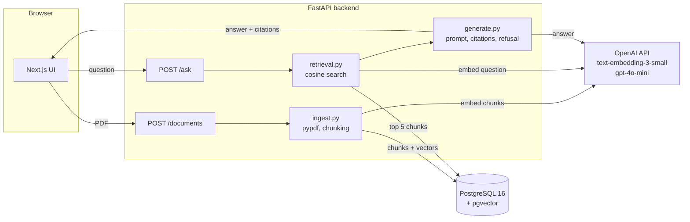
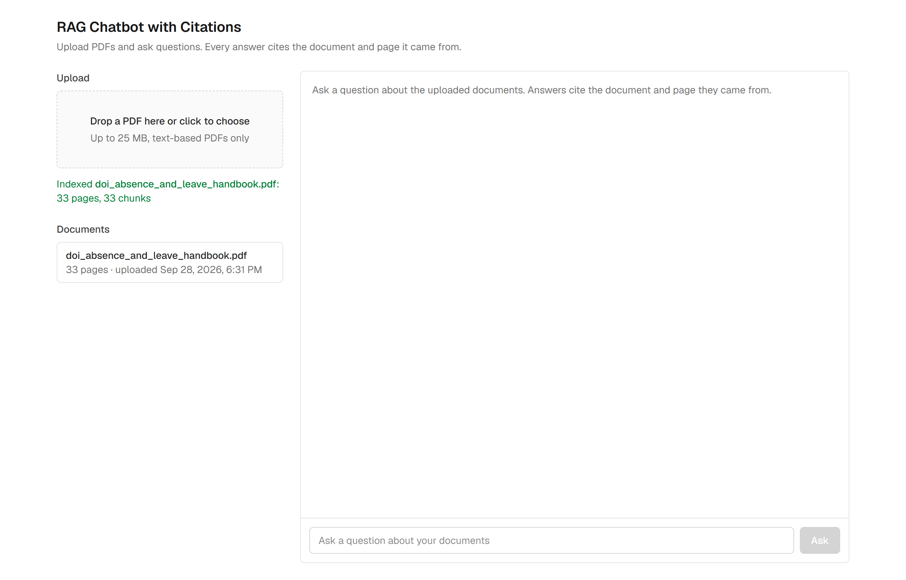
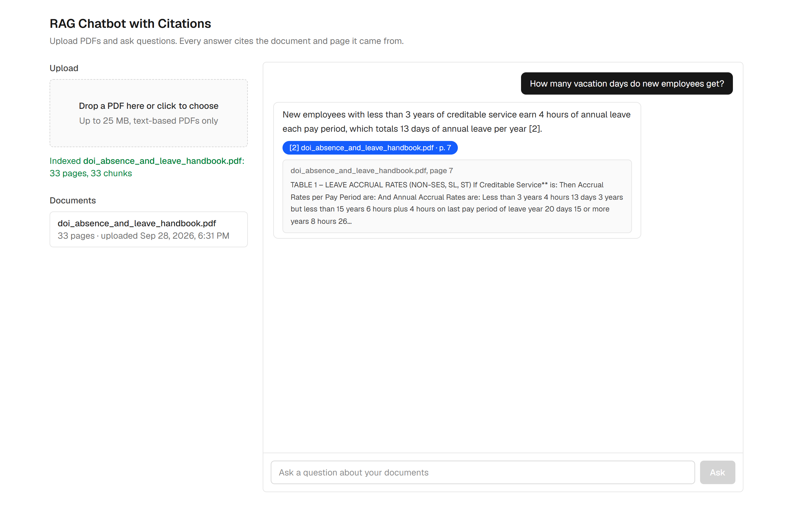
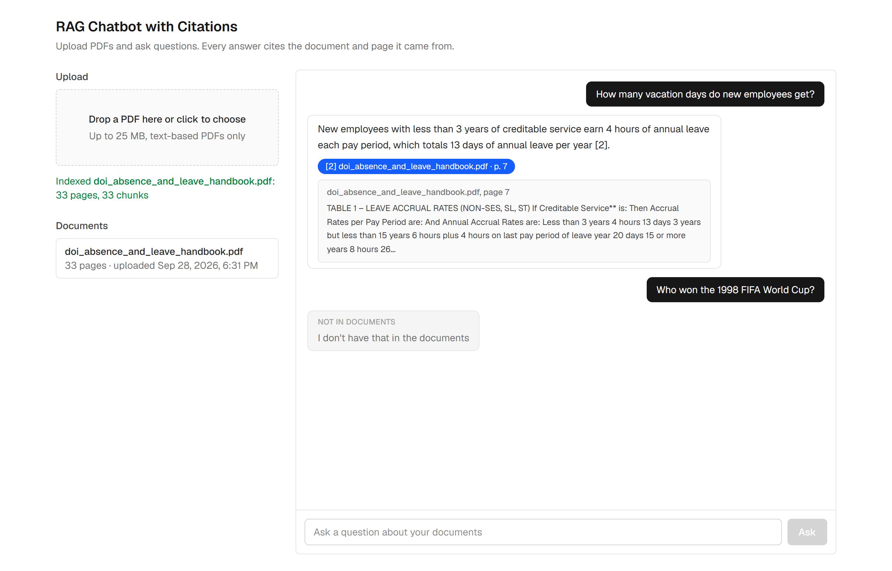

# RAG Chatbot with Citations

Upload PDFs, ask questions, and get answers grounded in those PDFs with document and page citations. When the documents do not contain the answer, the bot says exactly that instead of guessing.

Built with FastAPI, the OpenAI SDK used directly (no LangChain), PostgreSQL with pgvector, and Next.js.


## What it does

- **Upload PDFs.** Text is extracted page by page with pypdf, chunked within each page, embedded with `text-embedding-3-small` and stored in pgvector.
- **Ask questions.** The question is embedded, the five most similar chunks are retrieved by cosine similarity, and `gpt-4o-mini` answers using only those numbered sources.
- **Citations you can check.** Every answer returns the document name, page number and the sentence of the source that best matches the question. Only sources the model actually cited are returned.
- **Honest refusals.** If the retrieved sources do not contain the answer, the reply is exactly `I don't have that in the documents`, enforced both in code and in the prompt.
- **Measured, not assumed.** A 20-question evaluation set with answerable and unanswerable questions scores answer accuracy, citation accuracy and refusal accuracy.

## Architecture



Request flow:

```
Upload:  PDF --> text per page --> chunks within a page (600 words, 75 overlap)
             --> embeddings --> INSERT (document, page, chunk_index, text, embedding)

Ask:     question --> embedding --> top 5 chunks by cosine similarity
             --> prompt with numbered sources [1]..[5] --> gpt-4o-mini
             --> parse [n] markers --> answer + cited {document, page, snippet}
```

## Quick start with Docker Compose

Requirements: Docker Desktop and an OpenAI API key.

```bash
git clone https://github.com/Khalid-Mehmood-117/rag-chatbot-with-citations.git
cd rag-chatbot-with-citations
cp .env.example .env        # then set OPENAI_API_KEY in .env
docker compose up --build
```

Open http://localhost:3000. The API and its interactive docs are at http://localhost:8000/docs.

The database, backend and frontend start in order with health checks. Uploaded documents persist in a Docker volume.

If port 3000 is already taken on your machine, set `FRONTEND_PORT` and the matching `CORS_ORIGINS` in `.env` (see `.env.example`), for example `FRONTEND_PORT=3001` and `CORS_ORIGINS=http://localhost:3001`.

## Local development

Backend (Python 3.13):

```bash
docker compose up -d db
python -m venv .venv
.venv/Scripts/activate        # on macOS or Linux: source .venv/bin/activate
pip install -r backend/requirements.txt
uvicorn app.main:app --app-dir backend --reload --port 8000
```

Frontend (Node 24):

```bash
cd frontend
npm install
npm run dev
```

The frontend reads the backend URL from `NEXT_PUBLIC_API_URL` and defaults to `http://localhost:8000`.

Tests run without a database or network. OpenAI and the database are replaced with fakes:

```bash
cd backend
pytest
```

## API

| Method | Path | Body | Response |
|---|---|---|---|
| `POST` | `/documents` | `multipart/form-data`, field `file` (PDF, up to 25 MB) | `{ id, name, pages, chunks }` |
| `GET` | `/documents` | none | `[{ id, name, pages, chunks, uploaded_at }]` |
| `POST` | `/ask` | `{ "question": str, "document_ids"?: [uuid] }` | `{ answer, citations, refused }` |
| `GET` | `/health` | none | `{ "status": "ok" }` |

Example:

```bash
curl -F "file=@eval/sample_docs/doi_absence_and_leave_handbook.pdf" http://localhost:8000/documents

curl -X POST http://localhost:8000/ask -H "Content-Type: application/json" \
     -d '{"question": "How many vacation days do new employees get?"}'
```

```json
{
  "answer": "New employees with less than 3 years of creditable service earn 4 hours of annual leave each pay period, which totals 13 days of annual leave per year [2].",
  "citations": [
    {
      "index": 2,
      "document": "doi_absence_and_leave_handbook.pdf",
      "page": 7,
      "snippet": "TABLE 1 - LEAVE ACCRUAL RATES (NON-SES, SL, ST) If Creditable Service** is: Then Accrual Rates per Pay Period are: And Annual Accrual Rates are: Less than 3 years 4 hours 13 days ..."
    }
  ],
  "refused": false
}
```

An unanswerable question returns:

```json
{ "answer": "I don't have that in the documents", "citations": [], "refused": true }
```

## How citations work

1. At ingest, pypdf yields text page by page. Chunks are created within a page, never across pages, so every chunk row knows its document and page number.
2. At query time the top five chunks are numbered and placed in the prompt as `[1] (handbook.pdf, p.12) <text>`.
3. The system prompt tells the model to answer only from the numbered sources and to append the bracket number after each claim.
4. The backend parses the `[n]` markers out of the answer and returns only the cited chunks. Uncited retrieved chunks are dropped.
5. The snippet shown under each citation is the sentence of the chunk with the most keyword overlap with the question and the answer, so the reader sees the relevant line rather than the top of the page.

## Refusal rule

Two layers make sure the bot does not guess:

- **Code layer.** If the best cosine similarity is below `SIMILARITY_THRESHOLD` (0.35), the model is not called and the refusal is returned directly. This catches clearly off-topic questions at zero cost.
- **Prompt layer.** The model is instructed to reply with the exact refusal sentence when the sources do not contain the answer. If the answer contains that sentence or cites no sources, the response is normalised to `answer = "I don't have that in the documents"`, `citations = []`, `refused = true`.

The threshold was chosen with `eval/tune_threshold.py`, which prints the best similarity per evaluation question. On the sample document, answerable questions scored 0.45 to 0.75 and unanswerable ones 0.03 to 0.49, so the two groups overlap and the prompt layer does the real work. The threshold is a cheap pre-filter, not a classifier.

## Evaluation

`eval/questions.json` holds 20 questions about the sample document, the US Department of the Interior "Absence and Leave Handbook" (2012), a public-domain federal publication: 15 answerable questions with the expected page and 5 unanswerable ones. `eval/run_eval.py` sends each question to `POST /ask`, asks `gpt-4o-mini` (temperature 0) whether the answer conveys the expected answer, checks that the expected document and page appear in the citations, and writes `eval/results.md`.

Latest results (2026-09-28):

| Metric | Result |
|---|---|
| Answer accuracy (all 20) | 100% |
| Answer accuracy (answerable) | 100% |
| Citation accuracy (answerable) | 100% |
| Refusal accuracy (unanswerable) | 100% |
| False refusals (answerable) | 0 of 15 |

The per-question table is in [eval/results.md](eval/results.md). To reproduce, start the stack, upload the sample PDF, then:

```bash
python eval/run_eval.py
```

A caveat for the honest reader: the questions were written by the author of the system, so this is a regression check rather than a benchmark. The set is easy to extend with harder paraphrases.

## Screenshots

Upload with page and chunk counts:



An answer with the citation expanded:



A refusal:



## Project structure

```
backend/
  app/
    main.py            FastAPI app, CORS, routers
    config.py          settings from environment
    openai_client.py   shared AsyncOpenAI client (a dependency, faked in tests)
    db.py              async engine, pgvector extension, table creation
    models.py          documents and chunks tables
    schemas.py         request and response models
    ingest.py          PDF -> pages -> chunks -> embeddings
    retrieval.py       query embedding, cosine search
    generate.py        prompt, model call, citation parsing, refusal rule
    routers/           documents.py, ask.py
  tests/               pytest with OpenAI and the database faked
  Dockerfile
frontend/
  app/                 Next.js App Router pages
  components/          UploadDropzone, DocumentList, ChatWindow, MessageBubble, CitationList
  lib/api.ts           typed client for the backend
  Dockerfile
eval/
  questions.json       20 questions with expected answers and pages
  run_eval.py          runs the set against /ask, writes results.md
  tune_threshold.py    best similarity per question, for the refusal threshold
  results.md           latest results
  sample_docs/         the public-domain sample PDF
docs/screenshots/      UI screenshots
docker-compose.yml     db + backend + frontend
PLAN.md                design and milestones
```

## Design decisions

- **Direct OpenAI SDK instead of LangChain.** Every step of the pipeline is a short, readable function in this repo. Fewer dependencies, nothing hidden.
- **One database for metadata and vectors.** pgvector keeps documents, chunks and embeddings in PostgreSQL with an HNSW index. No separate vector service to run.
- **Chunks never cross pages.** This costs a little retrieval quality on page boundaries and buys exact page citations, which is the point of the project.
- **Word-based chunking.** 600 words with a 75 word overlap is roughly 800 and 100 tokens. It avoids a tokenizer dependency and is easy to reason about.
- **Refusal in code and in the prompt.** The prompt alone is not reliable enough, and the threshold alone cannot separate on-topic from off-topic questions. Together they scored 5 of 5 refusals with 0 false refusals on the evaluation set.
- **Tests do not call OpenAI.** A small fake client stands in for embeddings and chat completions, so the suite runs offline in about two seconds.

## Possible extensions

Authentication and multi-user tenancy, streaming answers, OCR for scanned PDFs, a reranking step after retrieval, per-document filtering in the UI (the API already accepts `document_ids`), and document deletion.

## Sample document

The sample PDF is the US Department of the Interior "Absence and Leave Handbook" (March 2012), a work of the United States federal government and therefore in the public domain.
